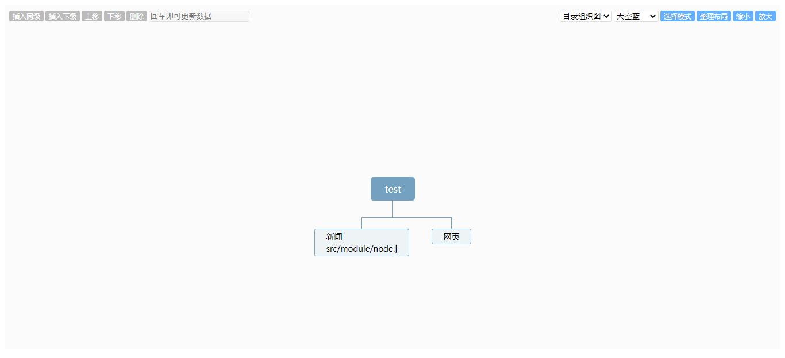

<h1 align="center">
    Vue kityminder
</h1>

<p align="center">
    <a href="https://www.npmjs.com/package/@orh/vue-kityminder">
        
    </a>
    <a href="https://www.npmjs.com/package/@orh/vue-kityminder">
        
    </a>
    <a href="https://github.com/ouronghuang/vue-kityminder">
        
    </a>
</p>

* 适用于 Vue 2/3 思维导图
* 基于 [kityminder-core](https://github.com/fex-team/kityminder-core)



## Vue 3.x

1. 安装

```bash
$ yarn add @orh/vue-kityminder@2
```

2. 引入

```javascript
import { createApp } from 'vue';
import App from './App.vue';
import VueKityminder from '@orh/vue-kityminder';

createApp(App).use(VueKityminder).mount('#app')
```

3. 使用

[示例代码](./src/App.vue)

## Vue 2.x

1. 安装

```bash
$ yarn add @orh/vue-kityminder@1
```

2. 引入

```javascript
import VueKityminder from '@orh/vue-kityminder';

Vue.use(VueKityminder);
```

## 使用

```html
<vue-kityminder
    style="height: 600px"
    ref="kityminder"
    theme="classic"
    template="fish-bone"
    :value="val"
    :toolbar-status="toolbar"
    @content-change="handleContent"
    @node-change="handleNode"
    @node-remove="handleRemove"
    @selection-change="handleSelection"
>
</vue-kityminder>
```

## Props

| 属性 | 说明 | 类型 | 默认值 |
| --- | --- | --- | --- |
| `value` | 数据格式 | `String` | 空 |
| `theme` | 主题 | `String` | `fresh-blue` |
| `template` | 模板 | `String` | `filetree` |
| `toolbar-status` | 工具栏的各项显示/隐藏 | `Object` | {} |

* `toolbar-status` 选项列表，可根据需要选择性配置

| 选项 | 功能 | 类型 | 默认值 |
| --- | --- | --- | --- |
| `show` | 整个工具栏 | `boolean` | `true` |
| `left` | 左侧工具栏 | `boolean` | `true` |
| `right` | 右侧工具栏 | `boolean` | `true` |
| `appendSiblingNode` | 插入同级 | `boolean` | `true` |
| `appendChildNode` | 插入下级 | `boolean` | `true` |
| `arrangeUp` | 上移 | `boolean` | `true` |
| `arrangeDown` | 下移 | `boolean` | `true` |
| `removeNode` | 删除 | `boolean` | `true` |
| `text` | 文本框 | `boolean` | `true` |
| `template` | 模板 | `boolean` | `true` |
| `theme` | 主题 | `boolean` | `true` |
| `hand` | 模式 | `boolean` | `true` |
| `resetLayout` | 整理布局 | `boolean` | `true` |
| `zoomOut` | 缩小 | `boolean` | `true` |
| `zoomIn` | 放大 | `boolean` | `true` |

## Events

| 事件 | 说明 | 回调参数 |
| --- | --- | --- |
| `content-change` | 新增/编辑/删除时触发事件 | 所有节点数据 |
| `node-change` | 新增/编辑时触发事件，其中新增返回的节点 `id` 为 `0` | 当前节点数据 |
| `node-remove` | 删除时触发事件 | 当前节点数据 |
| `selection-change` | 当前选中的节点 | 当前节点数据 |
| `template-change` | 变更模板时触发 | 当前模板标识名 |
| `theme-change` | 变更主题时触发 | 当前主题标识名 |

* 删除按钮绑定的是双击事件

## 本地开发/预览

1. 安装依赖

```
$ yarn
```

2. 运行

```
$ yarn serve
```

## License

MIT
