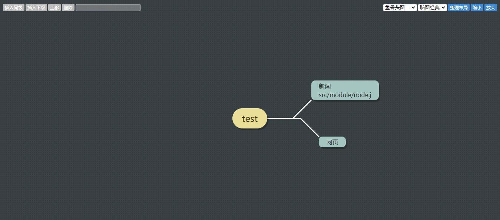

<h1 align="center">
    Vue 2 kityminder
</h1>

<p align="center">
    <a href="https://www.npmjs.com/package/@orh/vue-kityminder">
        
    </a>
    <a href="https://www.npmjs.com/package/@orh/vue-kityminder">
        
    </a>
    <a href="https://github.com/ouronghuang/vue-kityminder">
        
    </a>
</p>

* 适用于 Vue 2 思维导图
* 基于 [kityminder-core](https://github.com/fex-team/kityminder-core)



## Vue 2.x

1. 安装

```bash
$ yarn add @orh/vue-kityminder
```

2. 引入

```javascript
import Vue from 'vue';
import App from './App.vue';
import VueKityminder from '@orh/vue-kityminder';

Vue.use(VueKityminder);

Vue.config.productionTip = false;

new Vue({
  render: h => h(App)
}).$mount('#app');
```

3. 使用

```vue
<template>
  <div id="app">
    <vue-kityminder
        style="height: 600px"
        :value="val"
        @content-change="handleContent"
        @node-change="handleNode"
        @node-remove="handleRemove"
    >
    </vue-kityminder>
  </div>
</template>

<script>
export default {
  name: 'App',
  data() {
    return {
      val: {
        data: {
          id: 1,
          text: 'test'
        },
        children: [
          {
            data: {
              id: 2,
              text: '新闻\nsrc/module/node.j'
            }
          },
          {
            data: {
              id: 3,
              text: '网页'
            }
          }
        ]
      }
    }
  },
  methods: {
    handleContent(data) {
      console.log(data);
    },
    handleNode(data) {
      console.log(data);
    },
    handleRemove(data) {
      console.log(data);
    }
  }
}
</script>
```

## Props

| 属性 | 说明 | 类型 | 默认值 |
| --- | --- | --- | --- |
| value | 数据格式 | String | 空 |

## Events

| 事件 | 说明 | 回调参数 |
| --- | --- | --- |
| content-change | 新增/编辑/删除时触发事件 | 所有节点数据 |
| node-change | 新增/编辑时触发事件，其中新增返回的节点 `id` 为 `0` | 当前节点数据 |
| node-remove | 删除时触发事件 | 当前节点数据 |

* 删除按钮绑定的是双击事件

## 本地开发/预览

1. 安装依赖

```
$ yarn
```

2. 运行

```
$ yarn serve
```

## License

MIT
